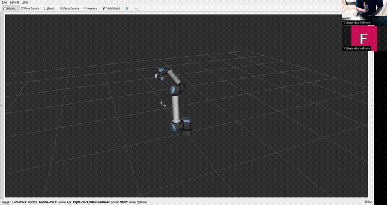

# Robot Arm Teleoperation via Smartphone Pose Estimation

Teleoperate a UR10e robot arm using an iPhone as a 6-DOF spatial input device. The phone's pose (tracked via ARKit) drives the robot through velocity mode (resolved-rate Jacobian control) or position mode (analytical closed-form IK). The robot is visualized in RViz 2 with real-time feedback sent back to the phone.

**ME/CDS/EE 235a: Advanced Robotics Kinematics** -- Final Project
California Institute of Technology, Winter 2026

**Collaborators:** Firdavs Nasriddinov & Sebastian Banuelos

📄 **[Full Report (PDF)](report/Robot_Arm_Teleoperation_Report.pdf)** | 🎥 **[Full Demo Video](https://drive.google.com/file/d/1iJ-YPce5TwE5rri7qKfI2MuopTnw3I6X/view?usp=sharing)**

<p align="center">
  
</p>

## Architecture

```
iPhone (ARKit)  --->  FastAPI Relay Server  --->  ROS 2 Kinematics Node + RViz
                <---     (WebSocket)        <---      (feedback)
```

## Prerequisites

- **macOS** with Xcode 16+ (for iOS app)
- **iPhone** with iOS 17+ and ARKit support (iPhone SE 2nd gen or later; LiDAR optional)
- **Ubuntu** with ROS 2 Humble installed
- **Python 3.11+** with [uv](https://docs.astral.sh/uv/) package manager
- iPhone and computer must be on the **same WiFi network**

## 1. iOS App

### Install to iPhone via Xcode

1. Open `app/robot_arm_teleop/robot_arm_teleop.xcodeproj` in Xcode
2. Select your development team under **Signing & Capabilities**
3. Connect your iPhone via USB or select it as a wireless destination
4. Select your device as the build target and press **Cmd+R** to build and run

### Usage

1. Open the app on your iPhone
2. Tap the **gear icon** to open Settings
3. Enter the server URL: `ws://<your-computer-ip>:8000/ws`
4. Tap **Connect** (green dot confirms connection)
5. Select control mode (Velocity or Position)
6. Tap the **play button** to start AR tracking -- move your phone to control the robot
7. Tap the **blue reset button** to snap the robot to home position and re-reference your phone's pose

## 2. Server

The relay server forwards messages between the iOS app and the ROS node. From the project root:

```bash
cd server
uv run uvicorn main:app --reload --host 0.0.0.0 --port 8000
```

Or use the run script:

```bash
cd server
uv run bash run.sh
```

The debug dashboard is available at `http://localhost:8000/dashboard`.

## 3. ROS 2

### Build

```bash
cd ros
colcon build --symlink-install
source install/setup.bash
```

### Launch

```bash
ros2 launch robot_arm_teleop visual.launch.py
```

This starts:
- `robot_state_publisher` (URDF to TF)
- `rviz2` (visualization)
- `kinematics_node` (IK + WebSocket bridge)
- `ros2 bag record` (auto-records `/joint_states` to `ros/data/`)

To connect to a server on a different machine:

```bash
ros2 launch robot_arm_teleop visual.launch.py server_url:=ws://<server-ip>:8000/ws/ros
```

### Plot Rosbag Data

```bash
python ros/src/visualize_joint_states.py ros/data/<bag_directory> [OPTIONS]
```

Options:
- `--trim-wait` -- Remove initial idle period before first movement
- `--time-range START END` -- Only plot data between START and END seconds

Example:

```bash
python ros/src/visualize_joint_states.py ros/data/joint_states_2026-03-21_14-30-00 --trim-wait --time-range 0 30
```

Plots are saved as `joint_states.png` inside the bag directory.

## Project Structure

```
robot-arm-teleop/
├── app/                  # iOS app (Xcode project)
├── server/               # FastAPI WebSocket relay + dashboard
│   ├── main.py
│   └── dashboard.py
├── ros/                  # ROS 2 Humble workspace
│   ├── src/
│   │   ├── robot_arm_teleop/         # ROS 2 package
│   │   └── visualize_joint_states.py # Rosbag plotting
│   └── data/             # Recorded rosbags
├── report/               # LaTeX project report
└── pyproject.toml        # Python dependencies (uv)
```
